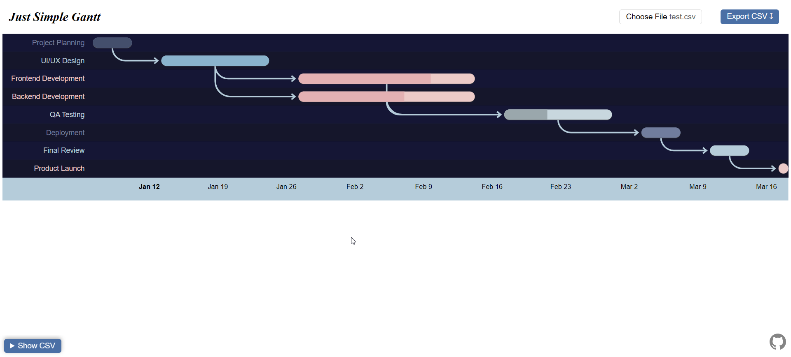
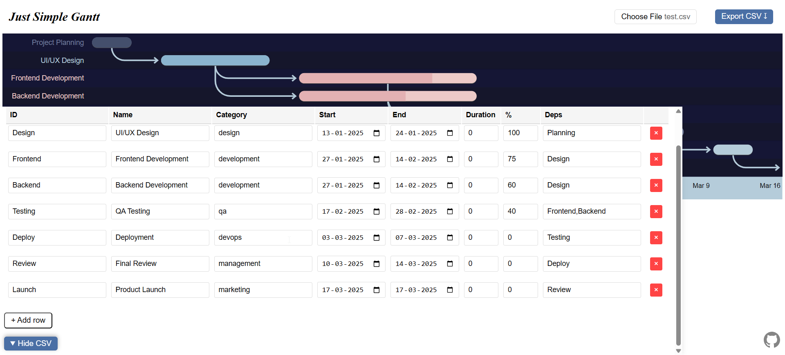

# Just Simple CSV Gantt Chart

A minimal Gantt chart generator (rendered using Google charts) from and to CSV.




## Features

- Import/Export CSV
- Inline editing with live preview
- Themeable (swap CSS/JS files)
- Keyboard shortcuts (ESC to hide editor)
- All google gantt chart features

## Usage

1. Open `index.html`
2. Import your CSV or edit the sample data
3. Press ESC to hide editor and view chart
4. Export when done

## CSV Format
```csv
id,name,resource,start,end,duration,percent,deps
Task1,My Task,category,2025-01-01,2025-01-05,0,50,
Task2,Next Task,,2025-01-06,2025-01-10,0,0,Task1
```

## Theming

Create a `theme-custom.js` file:
```javascript
const THEME = {
  gantt: {
    trackHeight: 35,
    barHeight: 20,
    palette: [
      { color: '#4285f4', dark: '#1967d2', light: '#a8c7fa' }
    ]
  }
};
```

Update `index.html`:
```html
<script src="theme-custom.js"></script>
```

## Screenshot Mode
Want a clean chart for presentations or screenshots?

1. Open browser DevTools (F12)
2. Find <body class="show-control">
3. Change to <body class="hide-control">
4. Take screenshot (no buttons, no clutter)

### Why no "Export as Image" button?
Following suckless philosophy: your OS already has screenshot tools (Win+Shift+S, Cmd+Shift+4, Print Screen). Why add 50+ lines of canvas rendering code when you can press two keys?
Plus, you control the exact framing, resolution, and format. Browser screenshots > generated images for most cases.

## Philosophy

Following the [suckless philosophy](https://suckless.org/philosophy/):
- No unnecessary features
- Readable code
- Browser does the heavy lifting
- One HTML file to rule them all

## License

MIT